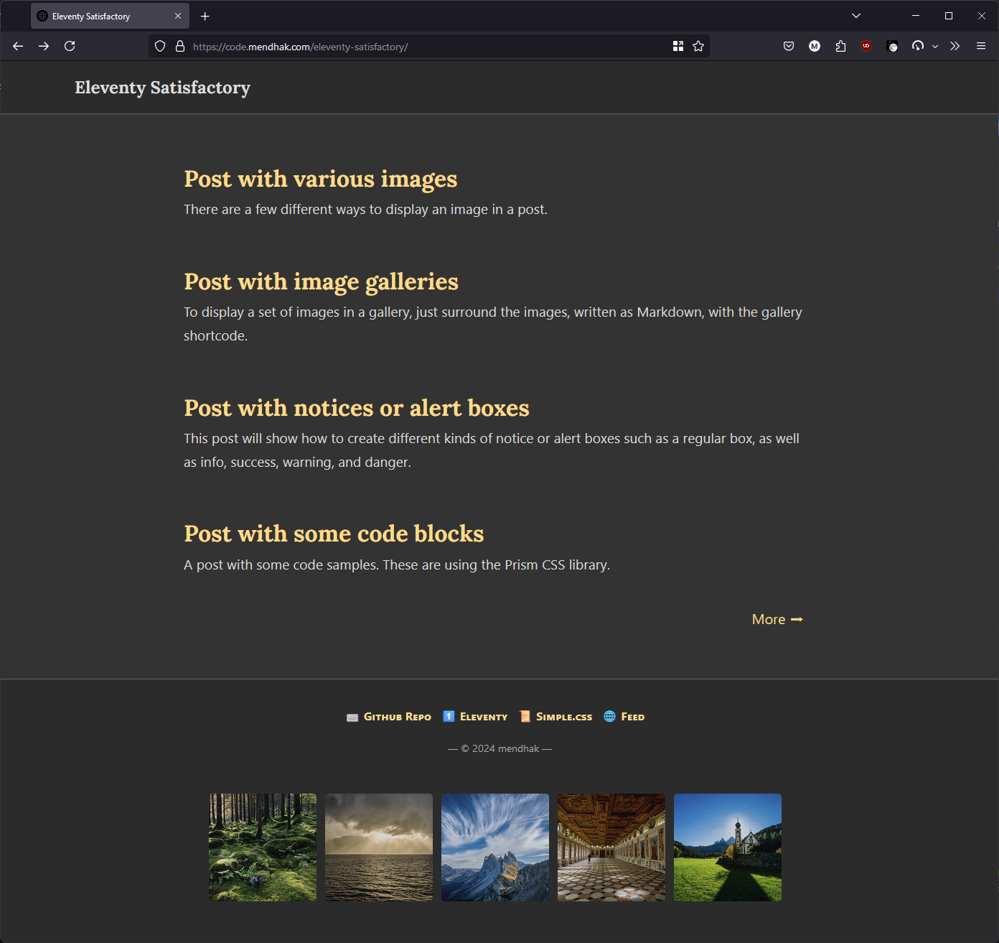
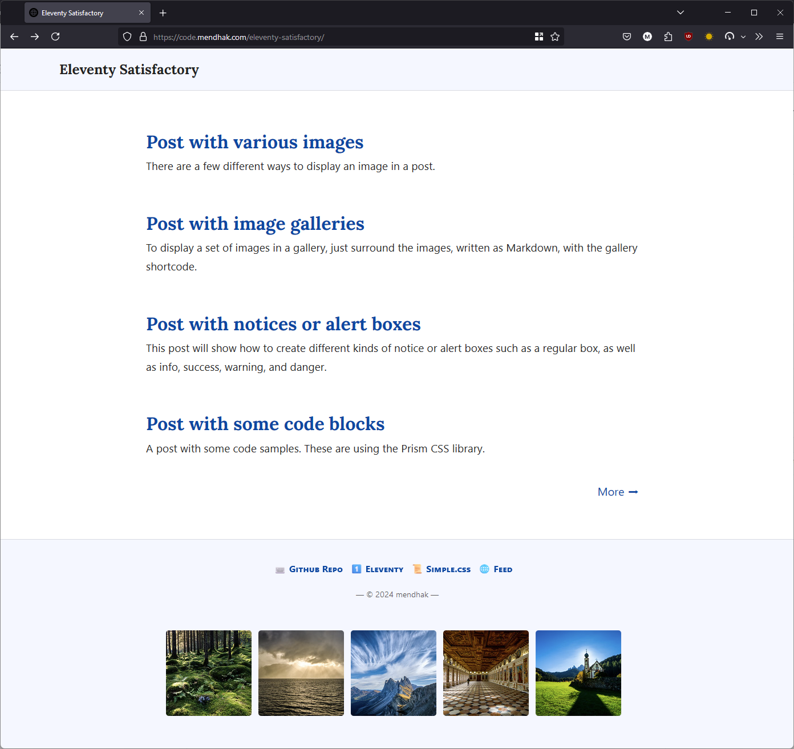

# Eleventy Satisfactory Blog Theme 
[](https://github.com/mendhak/eleventy-satisfactory/actions/workflows/staticsite.yml) [](https://github.com/mendhak/eleventy-satisfactory/actions/workflows/playwright.yml)

An Eleventy blog theme focused on content, and various convenience features. [Demo](https://code.mendhak.com/eleventy-satisfactory/). 


|||
|:--|:--|

Makes use of SimpleCSS, with inspiration from Hylia and minimal-mistakes. I developed it for [my blog](https://code.mendhak.com).

**Features**

* My focus is mainly on content, and less on everything else (author, social, tags, etc).
* Images using regular Markdown syntax are displayed with lightbox
* Image gallery with captions
* Link to a post's .md file is converted to final URL
* Links and images paths automatically adjusted to match blog prefix
* Main CSS is inline in the page
* Automatic light and dark mode
* Simplified post layout with date at bottom
* Simplified home page layout
* Adjust number of post listings
* Post excerpts below post listings
* Links, year, copyright, and photos in footer
* Opengraph and JSON+LD metadata for posts including preview image
* Code blocks rendered using Prism syntax highlighting
* Notice boxes such as info, warning, success
* Seamless gist integration as code blocks
* Github repo cards generator
* No tags listings, no site navigation, no social, no landing page, no analytics
* Draft posts appear locally
* UI testing (for this repo)
* Github Actions for publishing
* Extra wide images, videos and code blocks to make it extra-wide and stand out from the text
* Full width images and videos
* Robots.txt, .well-known folder
* Favicon


## How to use this blog theme

Generate a repo from this public template, or fork it.   
Delete the `tests/` folder and `.github/workflows/playwright.yml`    

### Configuration

- [Set your values in the metadata.json file](https://code.mendhak.com/eleventy-satisfactory/edit-the-metadata/)
- [Set the footer links and images](https://code.mendhak.com/eleventy-satisfactory/set-footer-links/)


### Write a post

The posts go in the `posts` folder.  Drafts can go in the `drafts` folder and will only appear when running locally (`npm run start` or `docker compose up`) but not when building (`npm run build`). 

- [Set the date of a post](https://code.mendhak.com/eleventy-satisfactory/set-date-of-post/)
- [Add an image](https://code.mendhak.com/eleventy-satisfactory/post-with-an-image/) 
- [Add an image gallery](https://code.mendhak.com/eleventy-satisfactory/post-with-a-gallery/)
- [Link to another post or URL](https://code.mendhak.com/eleventy-satisfactory/posting-links/)
- [Add a notice panel with info, warning, success, danger](https://code.mendhak.com/eleventy-satisfactory/post-notice/)
- [Add a code block with syntax highlighting](https://code.mendhak.com/eleventy-satisfactory/post-with-code/)
- [Add a Github Gist](https://code.mendhak.com/eleventy-satisfactory/post-with-github-gists/)
- [Add a Github Repo Card](https://code.mendhak.com/eleventy-satisfactory/github-repo-card/)   
- [Add videos and audio](https://code.mendhak.com/eleventy-satisfactory/post-with-iframes-videos-third-party/)
- [Controlling extra-wide images, videos, code blocks](https://code.mendhak.com/eleventy-satisfactory/extra-wide-full-width-images-videos/)
- [Set Opengraph preview image and metadata](https://code.mendhak.com/eleventy-satisfactory/opengraph-preview-data/)


Publish it. I've included a [sample Github Action](.github/workflows/staticsite.yml), use or modify as you need.  


## How to run the blog locally

**Running it with Docker**

This will do the npm install and npm start together. 

```
docker compose up
```

Then browse to http://localhost:8080/


**Running it with Node**

Requires Node 20. First get all the dependencies. 

```
npm install
```

To serve the site, and watch for changes: 

```
npm run start
```

Then browse to http://localhost:8080/


To just build the site once (normally used for Github Actions): 

```
npm install
npm run build
```

**Running Tests**

Make sure Firefox is installed. `sudo apt install firefox`

Run Playwright tests, this should automatically do an npm start first. 

```
npm test
```

## Updating

Once you've forked this repo, copying new features and updates from this repo to yours shouldn't be done wholesale. Instead, a diff tool like meld or Beyond Compare is recommended. 

For commandline, here's a useful rsync command which copies most files and excludes some unnecessary ones.  At least it's a starting point:   

```
cd your-blog-repo  
rsync -av --progress ../eleventy-satisfactory/ ./ \
--exclude '.git' \
--exclude 'tests'  \
--exclude '_site'  \
--exclude 'node_modules'  \
--exclude 'posts' --include 'posts/posts.json'  \
--exclude 'drafts' --include 'drafts.11tydata.js'  \
--exclude 'playwright*'  \
--exclude 'test*'  \
--exclude 'bottomlinks.json' \
--exclude 'screenshots'
```

After the rsync, it's still worth doing a git diff to see what's changed, or if there are any conflicts.  


## Notes

**TODO/Investigate**

- Can the cssmin shortcode adjust the inline url() paths? That could allow putting the font lines into its own CSS file. 
- Can the Github CSS be included just once, instead of once per card? This could be done using WebC, have to wrap my head around it. 
- Should the gallery behave the same for gallery + markdown and gallery + shortcode? 
- There isn't a _clean_ way to give users the ability to [toggle light and dark mode](https://github.com/mendhak/eleventy-satisfactory/issues/2)


**References**

- [Eleventy](https://www.11ty.dev/docs/)
- [Simple.css](https://github.com/kevquirk/simple.css/wiki)
- [Favicon created by Uniconlabs](https://www.flaticon.com/free-icons/website)
- [Article icon by Freepik](https://www.flaticon.com/free-icons/blog)
- [Paired shortcode](https://www.markllobrera.com/posts/eleventy-paired-shortcodes-and-markdown-rendering/)
- [Shortcode with image gallery](https://www.markllobrera.com/posts/eleventy-building-image-gallery-photoswipe/)
- [Customizing markdown-it](https://publishing-project.rivendellweb.net/customizing-markdown-it/)


